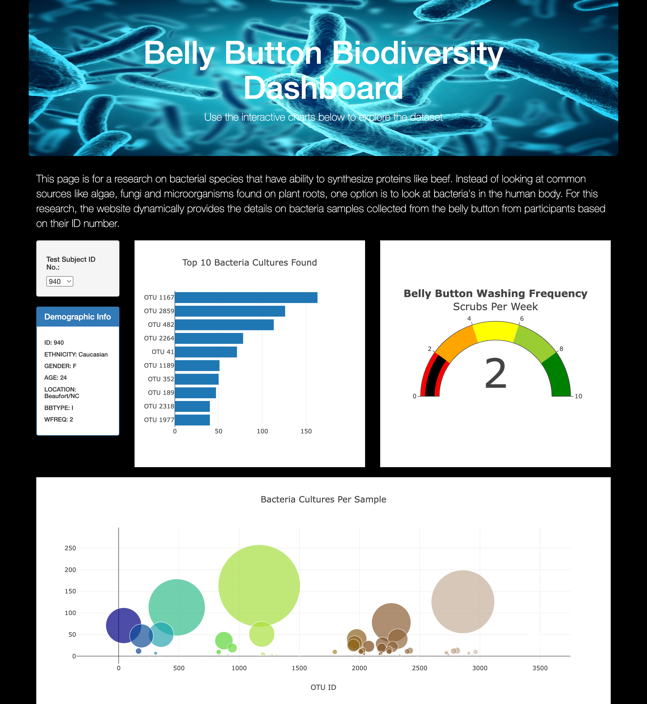
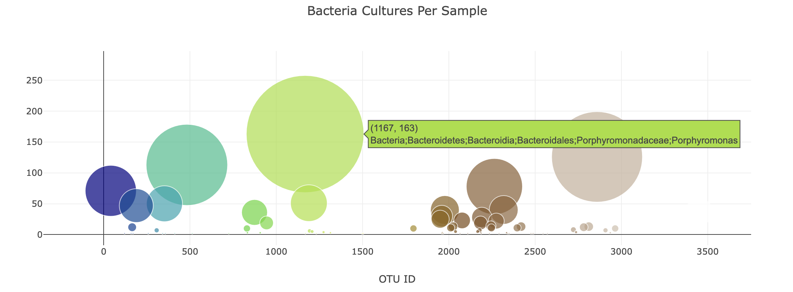

# Bacteria Research from Human Body

## Overview of the Project

This project is for a research on bacterial species that have ability to synthesize proteins like beef. Instead of looking at common sources like algae, fungi and microorganisms found on plant roots, one option is to look at bacteria's in the human body.

For this research, a dataset containing the details of the participants along with the results was collected. Using this data, a website is required to take the participant ID as an input and all the details on participant and bacteria samples collected from the belly button should be provided in the site with meaningful visualizations.

## Resources
- Data Source: samples.json
- Software: Python 3.9.7, Visual Code, javascript, bootstrap, html
---

## Results

The webpage was built using javascript and bootstrap styles. Dynamic filter was added to populate the details of the participant. The webpage can be accessed through https://sanilveeravu.github.io/plotly_challenge/. Below is a sample of the webpage.

1. The bar chart was built to dynamically change based on the participant ID with the top samples.

2. The bubble chart was built to use the whole sample. Below is a sample image with hovering enabled.

3. The gauge was built with the recommended 2 step ticks.

All the above features were build based on all of the requirements

### Additional Customizations

1. Added an image to jumbotron.
https://github.com/sanilveeravu/plotly_challenge/blob/e699b679ebb37bf84a7860e4323430766bdb8d27/static/css/style.css#L6-L11

2. Added black background color.
https://github.com/sanilveeravu/plotly_challenge/blob/e699b679ebb37bf84a7860e4323430766bdb8d27/static/css/style.css#L2-L4

3. Customized font color (White Color Font)
https://github.com/sanilveeravu/plotly_challenge/blob/aa24a0f41620b648e14e438d79dbfa9c5f2c67f9/static/css/style.css#L13-L15
https://github.com/sanilveeravu/plotly_challenge/blob/92b9f51909c93b582d37596daa09d7d78d9089b5/static/css/style.css#L6-L11

4. More information about the project in the site with bootstrap class
https://github.com/sanilveeravu/plotly_challenge/blob/e699b679ebb37bf84a7860e4323430766bdb8d27/index.html#L27

5. Responsive web page, one example below
https://github.com/sanilveeravu/plotly_challenge/blob/aa24a0f41620b648e14e438d79dbfa9c5f2c67f9/charts.js#L148-L151

---

## Summary

A very impressive dynamic webpage was built as part of this project providing all the planned features required. This webpage can be used both by the researchers and the participants.